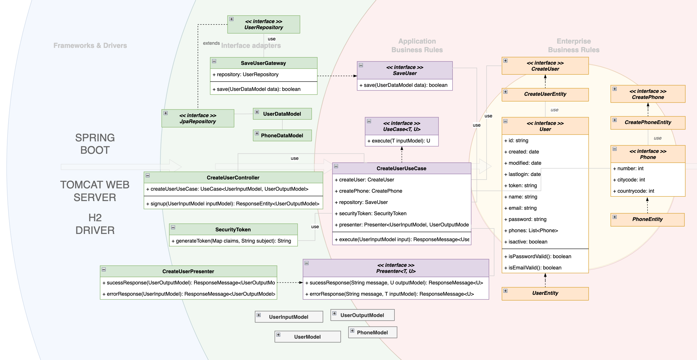
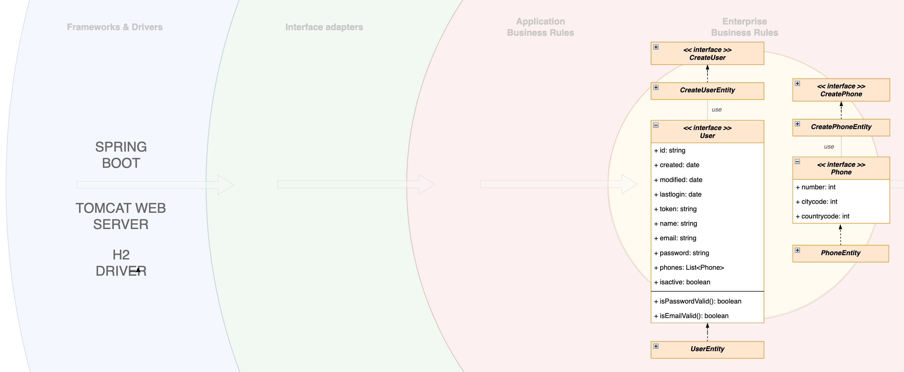
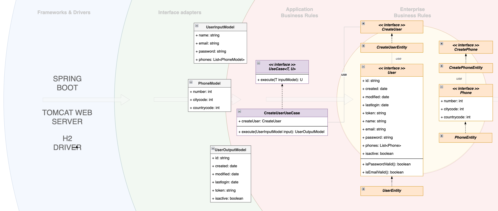
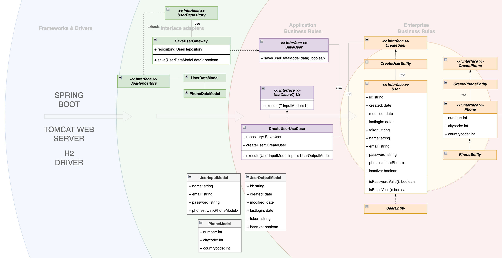
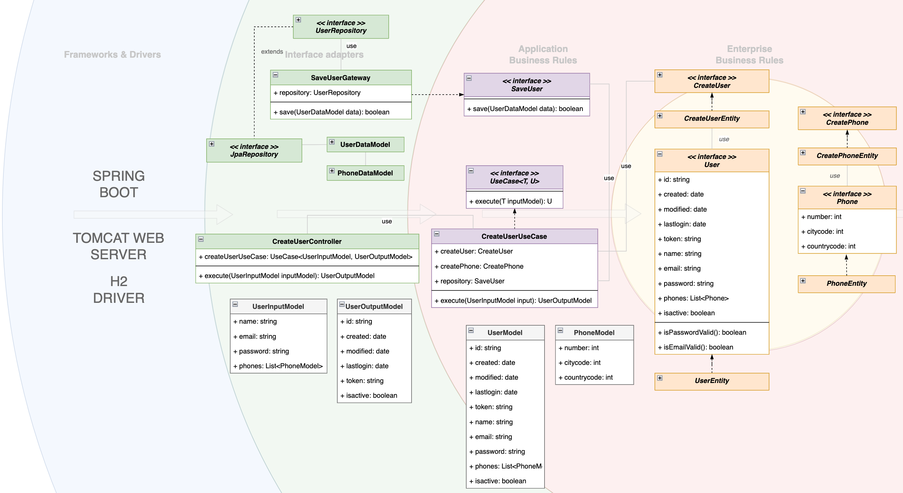
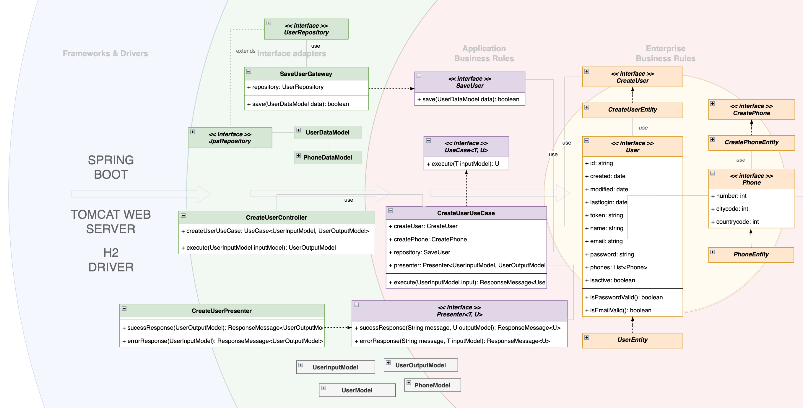
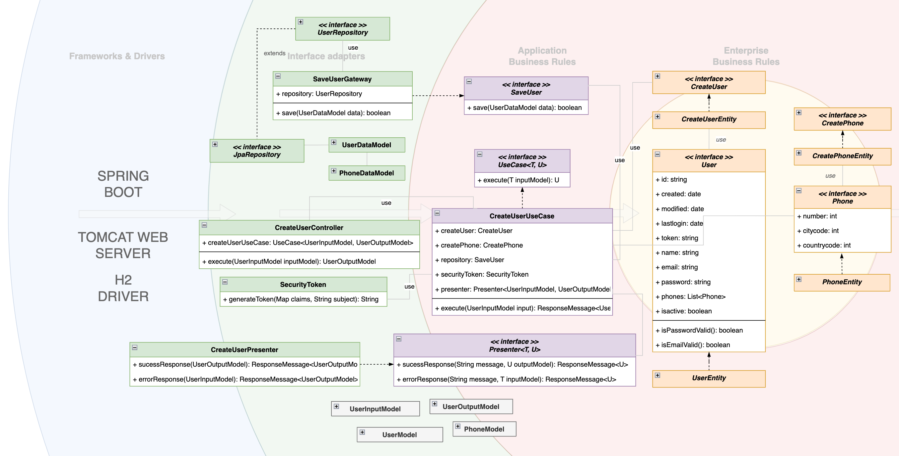
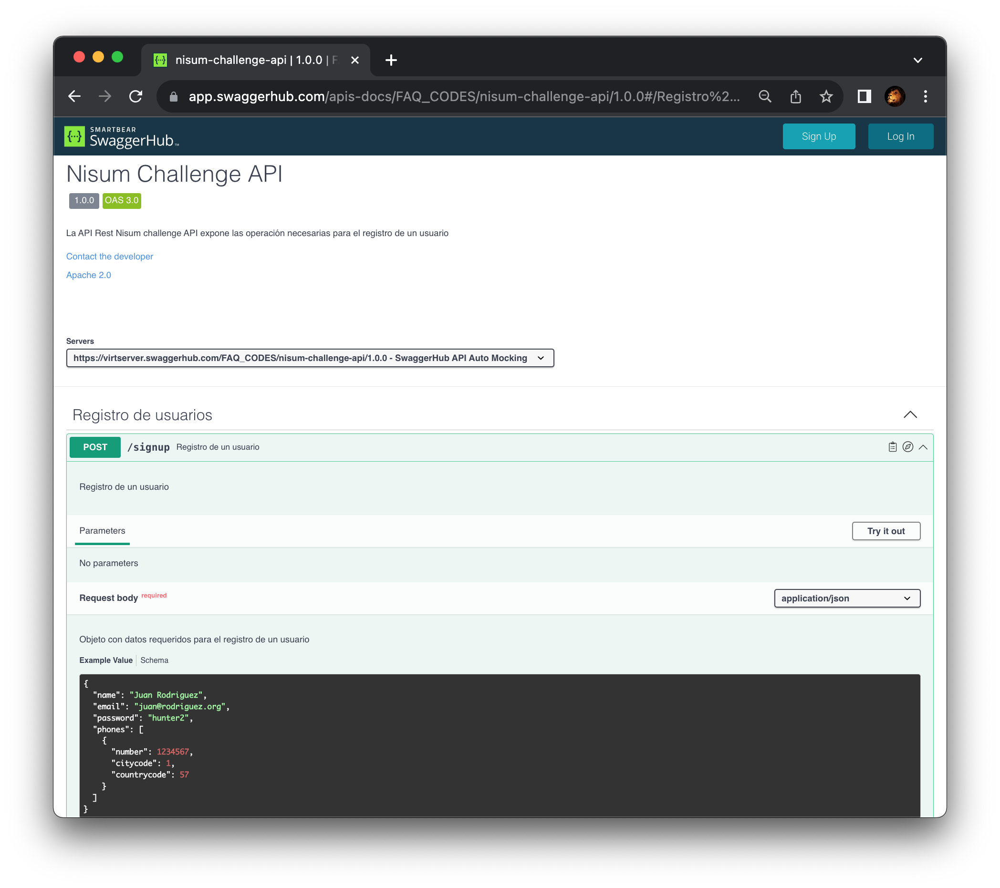

# DESAFÍO

Para el desarrollo del desafío, se utiliza los principios de [The Clean Architecture](https://blog.cleancoder.com/uncle-bob/2012/08/13/the-clean-architecture.html) aplicado al casos de uso.

Se intenta desacoplar en capas de tal manera de "proteger" las reglas de negocio de los detalles de la infraestructura utilizando inversión de dependencias y sin anotaciones de SpringBoot para desacoplar, por ejemplo, el DI framework

Se presentan esquemas de cómo se han desarrollado los casos de uso, desde las reglas de negocio hasta la implementación de las interfaces utilizadas

## Principios utilizados
---
- SOLID,
- DRY (Don't Repeat Yourself)
- SAP (Stable Abstractions Principle)


# Casos de uso: Registro de un usuario

Ese endpoint deberá recibir un usuario con los campos "nombre", "correo", "contraseña", más un listado de objetos "teléfono", respetando el siguiente formato:

```
{
  "name": "Juan Rodriguez",
  "email": "juan@rodriguez.org",
  "password": "hunter2",
  "phones": [
    {
      "number": "1234567",
      "citycode": "1",
      "contrycode": "57"
    }
  ]
}
````

- Responder el código de status HTTP adecuado
- En caso de éxito, retorne el usuario y los siguientes campos:
  - id: id del usuario (puede ser lo que se genera por el banco de datos, pero sería más deseable un UUID)
  - created: fecha de creación del usuario
  - modified: fecha de la última actualización de usuario
  - last_login: del último ingreso (en caso de nuevo usuario, va a coincidir con la fecha de creación)
  - token: token de acceso de la API (puede ser UUID o JWT)
  - isactive: Indica si el usuario sigue habilitado dentro del sistema.
- Si caso el correo conste en la base de datos, deberá retornar un error "El correo ya registrado".
- El correo debe seguir una expresión regular para validar que formato sea el correcto. (aaaaaaa@dominio.cl)
- La clave debe seguir una expresión regular para validar que formato sea el correcto. (El valor de la expresión regular debe ser configurable)
- El token deberá ser persistido junto con el usuario

# Diagrama de la solución

En el diagrama se muestran las clases que componen la solución siguiendo el diseño de [The Clean Architecture](https://blog.cleancoder.com/uncle-bob/2012/08/13/the-clean-architecture.html)

La idea de utilizar este diseño es encapsular la lógica de negocio separándola del framework, en este caso, Springboot. Por tanto, en las capas de Application Business Rules y Enterprise Business Rules se hace uso solo de JAVA sin las utilizadades de Springboot delegándolas a la capa de Interface Adapters



## La secuencia de construcción de la solución es como sigue:

Se crean las entidades de negocio con sus reglas


Se crea el caso de uso donde se crean las reglas de negocio de la aplicación 


Se crean las interfaces y clases que permiten crear y manejar el repositorio. Se utiliza JPA con H2


Se crea el controller que hace uso del caso de uso


Se crea el presenter que permite desacoplar la respuesta del caso de uso hacia las otras capas


Se genera el token JWT donde se desacopla su creación (otro ejemplo del uso del principio de Inversión de Dependencia)



TODO: 
Existen oportunidades de mejora desde que, por ejemplo, 
- la entidad Phone no posee ninguna regla de negocio
- la utilización de nuevas funciones según la versión de Java

# Documentación

Se ha generado el archivo `swagger-challenge.yml` con la documentación Open API (swagger) de la API



# Base de datos

Se ha implementado la solución con el uso de H2 como base de datos. La solución hace uso de JPA para la generación de las tablas en tiempo de ejecución, por tanto, NO HAY SCRIPT DE CREACIÓN DE BASE DE DATOS

Para la población de datos, se ha generado el archivo `resources/import.sql`el que inserta un registro una vez desplegada la solución

# Tests

Se han programado test básicos para la validación de las entidades


# Despliegue de la solución

La solución hace uso de Maven, por tanto, éste debe estar instalado.

Para compilar la aplicación, se debe ejecutar el comando:

```
mvn clean package install
```

Para ejecutar la aplicación, se debe ejecutar el comando:

````
mvn spring-boot:run
````

# Prueba de la solución

La API quedará disponible en la URL:

```
http://localhost:8080/api/signup
```

Para poder crear un nuevo usuario se puede utilizar el siguiente cURL:

```
curl --location 'localhost:8080/api/signup' \
--header 'Content-Type: application/json' \
--data-raw '{
    "name": "Juan Rodriguez",
    "email": "juan@rodriguez.org",
    "password": "qwe123ERT@",
    "phones": [
        {
            "number": "1234567",
            "citycode": "1",
            "contrycode": "57"
        },
        {
            "number": "33453346",
            "citycode": "9",
            "contrycode": "56"
        }
    ]
}'
```
